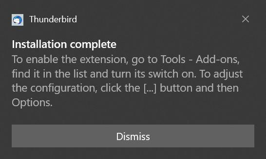
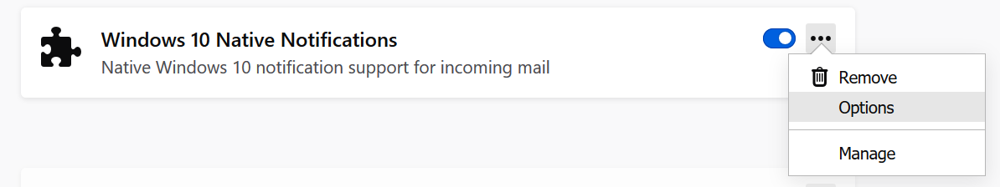
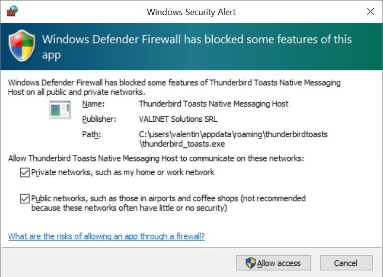

# Thunderbird Toasts

Thunderbird Toasts is a simple framework that allows Thunderbird to send Windows 10 toasts as notifications instead of its custom popup notifications that are not native. It works on Thunderbird 78+ as of January 2021 and can be thought of as a replacement for now defunct [GNotifier](https://github.com/mkiol/GNotifier).

## Features

* Supports native Windows 10 notifications for incoming mails
* Persistent notifications, ability to launch Thunderbird from notification
* Support for Thunderbird 78+
* Rich customizability
* Easy install and uninstall process
* Free, libre, open source software
* Frontend powered by the new Web Extensions API in Thunderbird
* Backend written in **pure C**, no third party libraries used aside from OS components (and not only Win32, but the modern Windows Runtime, without any intermediary or library)

The intent is for this to become flagship, showcase product of pure C programming and interfacing with the Microsoft Windows operating system.

## Installation

An installation package is available in the [releases](https://github.com/valinet/ThunderbirdToasts/releases) section of this repository.

To begin, download the latest available release. It comes in the form of an executable file, usually called *setup_thunderbird_toasts.exe*.

Before starting the installation, make sure that you saved all your work in Thunderbird, as the program will be reloaded so that the new add-on gets loaded in the program. Then, open the downloaded file and once it is done, a notification should pop-up and Thunderbird will open back up.



Now, you have to open the Add-ons Manager (Tools - Add-ons) and enable the extension in there, by toggling the switch near its name. Then, click "Enable" in the confirmation dialog.

To configure the add-on, click the settings icon and choose Options.



As you can see, the installation process is fully automated and self contained. The files are installed in your profile folder, in the following directory:

```
C:\Users\Valentin\AppData\Roaming\ThunderbirdToasts
```

Additionally, the extension is naturally placed in your Thunderbird profile directory (Help - Troubleshooting Information - Open Profile).

The following registry keys are created by the installer:

* `HKEY_CURRENT_USER\SOFTWARE\Classes\thunderbirdtoasts` - we register a custom protocol so we can handle activation from toasts that we display
* `HKEY_CURRENT_USER\SOFTWARE\Mozilla\NativeMessagingHosts\ThunderbirdToasts` - we register the native component of the solution with Thunderbird so that the add-on can make use of it

When you open the program for the first time, a Windows Firewall warning like the following may pop up. Please allow communications on all networks (the components internally communicate over local network sockets).



## Configuration

The options page presents a host of options that can help you customize the behavior of the add-on.

Text fields on the toast notifications that you can customize provide a series of variables that will be replaced with the particular value from the mail message for which the toast is displayed. The current list of variables is:

* @AUTHOR@ - Mail sender
* @BCCLIST@ - People in the Bcc list, comma separated
* @CCLIST@ - People in the Cc list, comma separated
* @DATE@ - Human readable date and time of the message
* @FOLDERACCCOUNT@ - Account of the folder the message is in
* @FOLDERNAME@ - Name of the folder the message is in
* @FOLDERPATH@ - Path of the folder the message is in
* @FOLDERTYPE@ - Type of the folder the message is in
* @MESSAGEID@ - ID of the mail message (Message-Id header)
* @RECIPIENTS@ - Full list of recipients
* @SUBJECT@ - Mail subject

More options may be provided in the future, and they will surely be mentioned here. Please suggest new, useful variables or functions [here](https://github.com/valinet/ThunderbirdToasts/issues).

Next. a brief explanation for each of the options the add-on supports is presented below. The default values are displayed besides each of the settings, so that it is easy to revert to factory configs. All the available tweaks are automatically saved.

* Heading, Contents, Footer - allows to customize the actual text that is displayed in each of these areas of the toast message
* Notification duration - how long the toast will sit on the screen; choice between 
  * "short" (approximately 5 seconds), 
  * "long" (10 seconds)
  * "persist" (the notification will be displayed on screen indefinitely, like a reminder - an additional button is displayed that allows you to dismiss the toast)
* Audio - you can choose from a variety of built-in sounds to customize the audio that is produced when a notification is displayed
* Sound effect - allows the sound to be played only once, or looped during the entire time the toast is displayed
* Show message in - defines the behavior when activating (clicking) a notification:
  * new tab - the message is displayed in a new tab in the main window
  * new window - a new window containing the message is displayed
  * 3-pane view - the message is displayed in the Message pane from the main window
* Application ID (advanced) - allows you to change the application Windows will display the toast as coming from; this is mostly a cosmetic change, clicks on the toasts will still open Thunderbird. By default, it is set to the application ID of Thunderbird. You can obtain a list of valid IDs by issuing the following command in PowerShell: `Get-StartApps`.
* Demo button - click this button to produce a notification with contents from a randomly selected mail of yours with the current configuration from the options page; this allows you to easily test how the settings will look once real mail starts arriving
* Uninstall - use this button to completely uninstall the add-on, deregister its associated background process and remove all entries from the Registry; removing the add-on via the classic means in Thunderbird still works, but it will only remove the extension and disable the background agent; registry modifications and program files will still be presented on the system
* About - displays brief information about the program and its developers, plus contact details and copyright notices.

## Inner workings

The product is made out of two main components:

* A Thunderbird add-on that interacts with the program, extracts data about incoming mail and displays it once the user interacts with the notifications
* A standalone program that runs in the background **only** when Thunderbird is running and that is used as an interface to the native OS ABI for producing the toast notifications

A custom URI scheme (protocol handler), `thunderbirdtoasts://` is installed on the system, allowing clicked toasts to open back in the Thunderbird application. The format of a request to this system is the following:

```
thunderbirdtoasts://111111111111/3682732184834846b73483784==
```

Where:

* `111111111111` is the epoch of the message (date and time of the message)
* `3682732184834846b73483784==` is the base64 encoded message-id

Internally, the protocol handler instance and the background process instance communicate via a socket that runs on the fixed TCP port `46578` (chosen randomly, fixed). Supported commands are similar to the URI schema, thus, you can make similar requests to the one above by using HTTP and standard client like:

```
curl 127.0.0.1:46578/111111111111/3682732184834846b73483784==
```

This will use the GET request of the HTTP protocol. You can send a random POST request to trigger a random notification to pop up (for testing purposes), while a DELETE request will uninstall the add-on.

## More details

I will publish more in-depth details soon, probably as a series of articles on [my web site](https://valinet.ro), for when time will allow.

This is a very good teaching example in my opinion, as it helps broaden your knowledge in a few diverse areas:

* Developing Web Extensions for most modern browsers, including Firefox, Chrome, Edge (Edgeium) etc
* Great examples of use of the new Thunderbird API
* Comprehensive use of the native messaging API of the browser, which is used to communicate with a background process that performs all the heavy lifting.
* The background agent is written in C, as I am targeting maximum efficiency. No hint of C++ in the entire source code. Furthermore, it is compiled without the standard library, in order to reduce space, using only OS APIs
* Speaking of OS APIs, extensive usage of all classes of Windows APIs; the C code contains no external libraries/headers. Instead, I decided to leverage the little exploited Windows APIs, and VERY LITTLE exploited when it comes to doing it from C directly. Of course, I use tons of Win32 APIs, but not only does the code do COM, but I use APIs from the Windows Runtime as well. Yes, indeed, the modern framework that provides all newer Microsoft Windows APIs accessed directly from C. That's how I display toasts, for example, no external PowerShell forking etc. Honestly, the notification part should be turned into its own standalone utility. Without embedding external resources in the executable, without the standard library, we get a very small binary which I am sure can be further reduced in size.

## Sources

ALL sources are available in this repository.

## Compiling

To put together the add-on, simply zip the contents of its "src" folder, change the extension to *xpi* and load in Thunderbird.

For details about the C native client, check the README in its folder: *src\native-app*.

## License

This product uses code from the following third party repositories:

* [cb_thunderlink](https://github.com/CamielBouchier/cb_thunderlink) - Copyright Camiel Bouchier (many thanks for his module). License: Original work is all rights reserved, however, I have obtained permission from the author of the project to use his work in my own project subject to the following terms and conditions:

  ```
  Camiel Bouchier (camiel@bouchier.be) grants Valentin Radu (valentin.radu@valinet.ro) a non-exclusive license to use the source code (i) copyrighted by Camiel Bouchier AND (ii) published on "https://github.com/CamielBouchier/cb_thunderlink" for whatever purpose provided that (i) the copyright notice is maintained AND (ii) such purpose is not having substantially the same functionality as cb_thunderlink such as published on "https://github.com/CamielBouchier/cb_thunderlink". THE SOFTWARE IS PROVIDED "AS IS" AND ANY EXPRESS OR IMPLIED WARRANTIES, INCLUDING, BUT NOT LIMITED TO, THE IMPLIED
  WARRANTIES OF MERCHANTABILITY AND FITNESS FOR A PARTICULAR PURPOSE ARE
  DISCLAIMED. IN NO EVENT SHALL Camiel Bouchier BE LIABLE FOR ANY
  DIRECT, INDIRECT, INCIDENTAL, SPECIAL, EXEMPLARY, OR CONSEQUENTIAL DAMAGES
  (INCLUDING, BUT NOT LIMITED TO, PROCUREMENT OF SUBSTITUTE GOODS OR SERVICES;
  LOSS OF USE, DATA, OR PROFITS; OR BUSINESS INTERRUPTION) HOWEVER CAUSED AND
  ON ANY THEORY OF LIABILITY, WHETHER IN CONTRACT, STRICT LIABILITY, OR TORT
  (INCLUDING NEGLIGENCE OR OTHERWISE) ARISING IN ANY WAY OUT OF THE USE OF THIS
  SOFTWARE, EVEN IF ADVISED OF THE POSSIBILITY OF SUCH DAMAGE.
  ```

* [EditEmailSubject-MX](https://github.com/cleidigh/EditEmailSubject-MX) - Copyright Team@EditEmailSubject-MX. License: [GNU General Public License v3.0](https://github.com/cleidigh/EditEmailSubject-MX/blob/master/LICENSE)

* [Windows classic samples](https://github.com/microsoft/Windows-classic-samples) - Copyright Microsoft Corporation. License: [MIT](https://github.com/microsoft/Windows-classic-samples/blob/master/LICENSE)

Taking into consideration the licenses of the individual components, the combined work of this project is released under GNU General Public License v3.0 or newer.

Additionally, I license all my original work that's separate from the third party bits used in this project under MIT license.